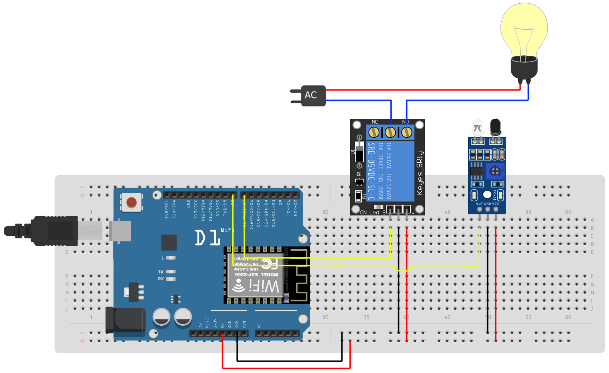
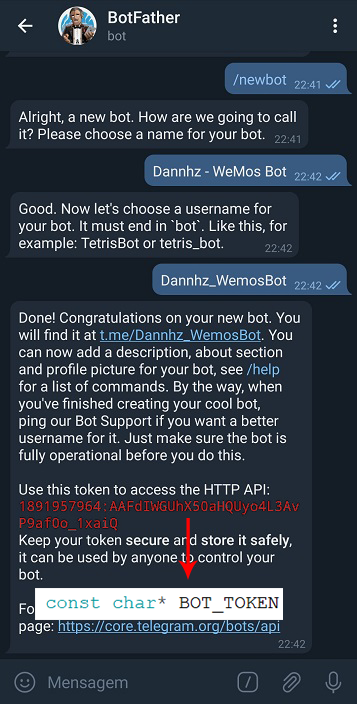
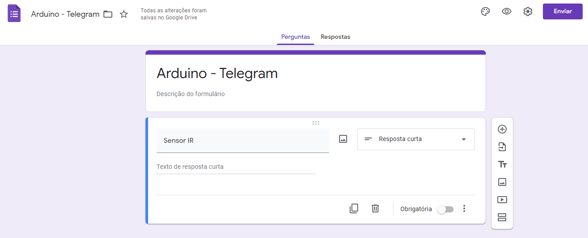
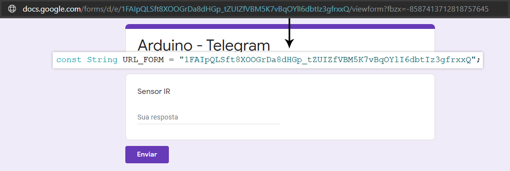
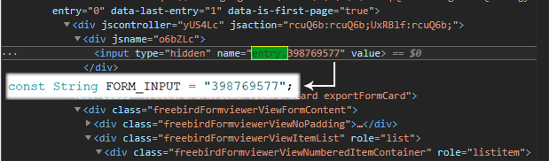

# ESP32 - Telegram/GDrive
## Algoritmo de envio/recebimento de mensagens do microcontrolador ao telegram (e vice-versa) com armazenamento de dados em nuvem através do GSheets.
=============================================
<!--ts-->
* [Sobre](#Sobre)
* [Circuito](#Circuito)
* [Arduino IDE](#Arduino-IDE)
* [Google Forms](#Google-Forms)
* [Telegram](#Telegram)
* [Referências](#Referências)

### Sobre
Projeto feito por hobby. Permite a conexão do ESP8266 com o aplicativo de mensagens Telegram, podendo servir para propostas diversificadas como um controle residencial ou um sistema de segurança (o exemplo elaborado é uma mescla simplificada dessas duas ideias) controlados por chat através de comandos-chave.
    Também armazena dados ao GSheets através do Google forms  
### Circuito

A figura abaixo ilustra o circuito utilizado baseado no código-fonte aqui fornecido.

Foi usado um sensor de obstáculo para exemplificar o uso em um sistema de segurança e um módulo relé para controle residencial.
Foi usado o microcontrolador Wemos D1 para a realização deste projeto. O passo-a-passo para sua configuração no Arduino IDE está disponível nas referências.

### Arduino IDE
É necessário instalar a biblioteca AsyncTelegram. As informações da biblioteca e outros requisitos adicionais para seu funcionamento podem ser encontradas em [cotestatnt/AsyncTelegram](http://github.com/cotestatnt/AsyncTelegram).

### Telegram
Inicie uma conversa com o BotFather e crie um novo bot inserindo o comando /newbot.
Será solicitado o nome do bot seguido de seu username, basta colocar o nome de sua escolha. O bot fornecerá um Token que atribuiremos à variável BOT_TOKEN

#### Google Forms
É necessário criar previamente um formulário linkado a uma planilha para armazenar os dados do sensor. Para isso basta acessar docs.google.com/forms, iniciar um novo formulário em branco com cada pergunta representando um registo. 
No exemplo foi feito uma pergunta/registro representando o sensor de obstáculo usado no circuito.

Após a criação das perguntas, clique em "Respostas" e "Criar planilha". Renomeie para o nome que desejar e clique em criar.
por fim, clique em "Visualizar" (ícone olho) para ver o resultado do formulário.
Teremos que pegar um trecho da URL da página que foi aberta e colocá-lo no valor da variável URL_FORM.

Por fim, teremos também que obter um atributo do input. Para isso, abra a ferramenta de desenvolvedor de seu navegador (Ctrl + Shift + I) e pesquise por "entry.". Será localizado um trecho com o valor da pesquisa, seguido por uma sequência de números. São esses números que serão atribuidos a variável FORM_INPUT.

### Referências

[cotestatnt/AsyncTelegram](http://github.com/cotestatnt/AsyncTelegram)

[Configurar e programar a placa D1 Wemos ESP8266 com Arduino - Sala Maker](https://www.youtube.com/watch?v=yehyUmUDJXc)

[Enviar dados do ESP8266 para o Google Sheets - FilipeFlop](https://www.filipeflop.com/blog/como-enviar-dados-do-esp8266-para-o-google-sheets/)